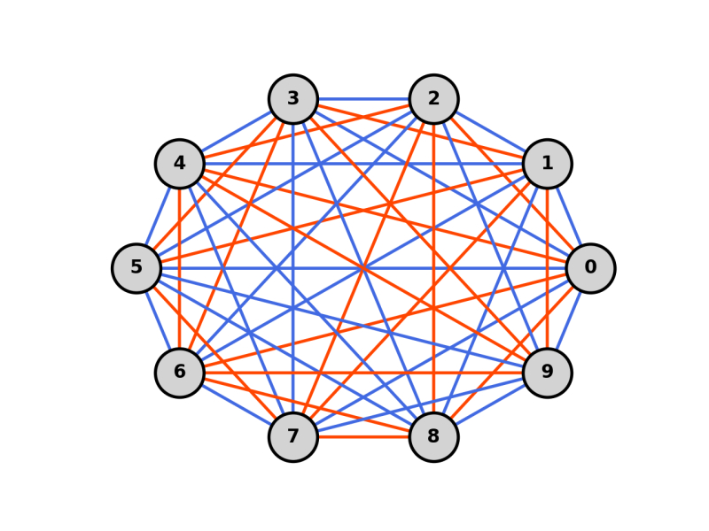

# MATH6010-homework


  - [Dependency](#dependency)
  - [Homework 1: Minimum Dominating Set](#homework-1-minimum-dominating-set)
    - [Solution](#solution)
  - [Homework 2: Monochromatic K4](#homework-2-monochromatic-k4)
    - [Solution](#solution-1)
  - [Homework 3: 0-1 Knapsack problem](#homework-3-0-1-knapsack-problem)
    - [Solution](#solution-2)
  - [Homework 3: Steiner Triple Systems](#homework-3-steiner-triple-systems)
    - [Solution](#solution-3)
  - [Homework 3: Uniform Graph Partition](#homework-3-uniform-graph-partition)
    - [Solution](#solution-4)


This repo contains my assignments for MATH6010 (2022 spring) at SJTU.

Follow the commands below to start.

```shell
git clone https://github.com/sszxc/MATH6010-homework.git
cd MATH6010-homework/
python -m pip install -r requirements.txt
```

## Dependency

[NetworkX](https://networkx.org/) for
the creation, manipulation, and study of the structure, dynamics, and functions of complex networks.

[matplotlib](https://matplotlib.org/) for creating static, animated, and interactive visualizations.

[tqdm](https://github.com/tqdm/tqdm) for a smart progress meter.

## Homework 1: Minimum Dominating Set

Definition: A dominating set for a graph $G=(V,E)$ is a subset $D$ of $V$ such that every vertex not in $D$ is adjacent to at least one member of $D$.

Theorem: Let $G=(V,E)$ be a graph on $n$ vertices, with minimum degree $\delta>1$. Then $G$ has a dominating set of at most $n[1+\ln(\delta+1)]/(\delta+1)$ vertices.

Task: Design a greedy algorithm to find a dominating set that satisfies the theorem.

### Solution

```python
python hw1_MinDomSet\min_dom_set.py
```

For example, the following is a solution for a given graph, which satisfies the theorem.


## Homework 2: Monochromatic K4

Definition: $K_n$ is a complete graph (a clique) with $n$ nodes.

Theorem: There is a two-coloring of $K_n$ with at most $C_n^4 2^{-5}$ monochromatic $K_4$.

Task: Design an algorithm based on derandomization to find a method of coloring the edges that satisfies the theorem.

### Solution

```python
python hw2_MonochromaticK4\monochromatic_k4.py
```

The algorithm is specially optimized to take only 23 seconds for a problem of 100 vertices.

For example, the following is a two-coloring solution for $K_{10}$. It has zero $K_4$ which is below the theoretical bound 6.56.



## Homework 3: 0-1 Knapsack problem

Given weights and values of n items, put these items in a knapsack of capacity W to get the maximum total value in the knapsack. 

Task: Design an algorithm based on simulated annealing to solve the 0-1 knapsack problem.

### Solution

```python
python hw3_knapsack\SimulatedAnnealing.py
```

For example, the following is the solving process for a given knapsack problem.


## Homework 3: Steiner Triple Systems

Definition: A Steiner triple system is a set system $(V,B)$ in which every block has size three, and every pair of points from $V$ is contained in a unique block. If $|V| =v$, then we denote such a system as an STS(v).

Task: Design a hill-climbing algorithm to construct random STS(v).

### Solution

```python
python hw3_STS\STS_HillClimbing.py
```

For example, the following gif is the solving process for STS(9). Here, the STS is presented as a hypergraph: the big green circles are the points, and the small gray circles are the blocks that connect three points.


## Homework 3: Uniform Graph Partition

[TBD]
### Solution

```python
python hw3_UniformGraphPartition\UniformGraphPartition.py
```